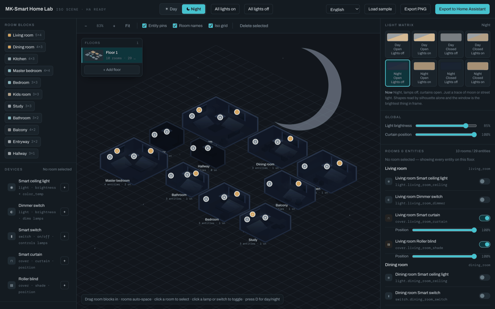
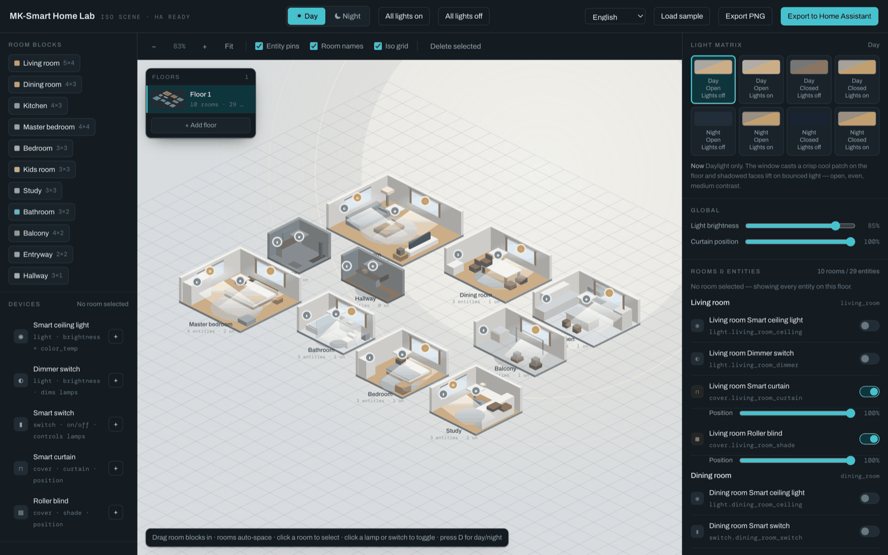
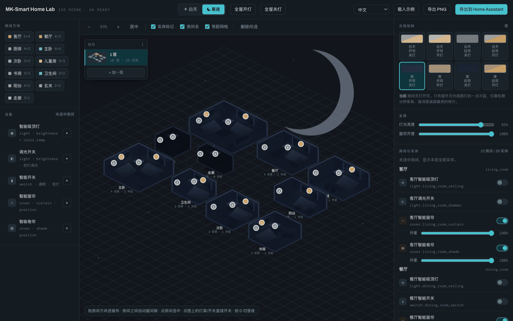

<div align="center">

# 🌙 MK-Smart Home Lab

**Draw your home. Flip the lights. Let Home Assistant deal with the YAML.**

One HTML file · no build step · no dependencies · 12 languages

### [▶ Try it right now](https://mklab.homes/floorplan/)

<sub>Mirror: [ming-kun.github.io](https://ming-kun.github.io/mk-ha-floorplan-editor/) — may be unreachable from mainland China 国内可能打不开</sub>

**[English](#english)**  ·  **[中文](#中文)**

</div>



---

## English

### The problem

You want a floor plan on your Home Assistant dashboard.

The usual route: open a vector editor, hand-draw ten rooms, export a PNG, then write YAML that pins every entity to a pixel coordinate you measured by squinting. Then someone buys a new lamp, and you do the whole thing again.

This is that, in a browser tab, in about four minutes.

Drag rooms onto the canvas. Drop lights and curtains into them. Hit export. **The layout you drew *is* the entity registry** — the data model is shaped like Home Assistant's own `floor` → `area` → `entity` tree, so exporting is a projection, not a translation.

### What you get

🏠 **Rooms that behave** — drag them in and they auto-space by two cells, so nothing hides behind anything else. Eleven room types, multiple floors, reorder and delete freely.

💡 **Five device types**, each mapped to a real HA domain:

| Drop this in | You get |
|---|---|
| Smart ceiling light | `light` · brightness + color_temp |
| Dimmer switch | `light` · brightness |
| Smart switch | `switch` |
| Smart curtain | `cover` · curtain · position |
| Roller blind | `cover` · shade · position |

🌗 **Eight lighting states, all of them real** — day/night × lights on/off × curtains open/closed, plus continuous sliders for brightness and curtain position. Press <kbd>D</kbd> to flip day and night. Click a lamp on the plan to toggle it. Watch the room actually respond.

📦 **Export that lands** — four artifacts and a background image:

- `picture-elements` YAML — the **native** HA card. Nothing to install.
- `ha-floorplan` config + `home.css` — if you have HACS and want the fancy one
- `scene.json` — the raw scene model
- Background PNG, at exactly the projection the coordinates assume

🌍 **12 languages** — English, 中文, Français, Deutsch, Italiano, Español, Português, Nederlands, Polski, Русский, 한국어, 日本語. Your smart home shouldn't be monolingual just because your thermostat is.



### Installing it

Easiest path is [the live demo](https://mklab.homes/floorplan/) — nothing to download.

Otherwise, there isn't an install. That's not an oversight, it's the whole point.

```bash
git clone https://github.com/Ming-kun/mk-ha-floorplan-editor.git
open mk-ha-floorplan-editor/index.html
```

You may run `npm install` in that directory if it makes you feel more at home. Nothing will happen. There is no `package.json`, no `node_modules`, and no 3 a.m. dependency audit in your future.

Works offline too — the only thing it ever fetches is a webfont.

### Getting it into Home Assistant

1. Build your plan and set the scene state you want as the dashboard's resting look
2. **Export to Home Assistant** → **Background** tab → save the PNG to `config/www/floorplan/home.png`
3. **picture-elements** tab → copy the YAML
4. In HA: new dashboard → YAML mode → paste

Exported entity ids follow `<domain>.<area>_<device>`, e.g. `light.living_room_ceiling`. Rename them to match your real entities — or rename your real entities to match these and pretend you planned it that way.

### How it actually works

Everything you see — walls, furniture, lamps, curtains — is the same box primitive, shaded across three faces. A lighting change therefore adjusts a handful of coefficients instead of re-deriving geometry, which is why all eight states stay visually consistent instead of slowly drifting apart.

It's rendered as a runtime-assembled SVG string. No canvas, no WebGL, no framework. 2:1 isometric projection, the finest projection 1997 had to offer, and still undefeated for this job.

### Questions you might reasonably have

**Does it send my floor plan anywhere?** No. It doesn't even contact its own author. Everything runs in your tab.

**Where's my data?** In your tab. Your language choice goes to `localStorage`, wrapped in a `try`/`catch` so private-browsing mode degrades quietly instead of exploding.

**Can I use this commercially?** Yes — Apache-2.0. Go ahead.

**Why is the moon a crescent?** Because a full disc looked like a grey circle and nobody could tell it was the moon. It took three attempts and a lecture about `fill-rule` semantics. Don't ask.

---

## 中文

### 要解决的事

你想在 Home Assistant 的面板上放一张户型图。

常规路线是:打开矢量编辑器,手画十个房间,导出 PNG,再对着屏幕眯着眼量像素,手写 YAML 把每个实体钉到坐标上。然后家里添了一盏灯,整套重来。

这个页面把它压缩成浏览器里的四分钟。

把房间拖进画布,往里塞灯和窗帘,点导出。**你画的布局本身就是实体注册表** —— 数据模型是照着 HA 自己的 `floor` → `area` → `entity` 结构长的,所以导出是投影,不是翻译。

### 有什么

🏠 **房间会自己让位** —— 拖进来自动留两格间隙,谁也不挡谁。十一种房型,支持多楼层,增删改序随意。

💡 **五种设备**,每种都对得上真实的 HA domain:

| 拖进去的 | 得到的 |
|---|---|
| 智能吸顶灯 | `light` · 亮度 + 色温 |
| 调光开关 | `light` · 亮度 |
| 智能开关 | `switch` |
| 智能窗帘 | `cover` · curtain · 开度 |
| 智能卷帘 | `cover` · shade · 开度 |

🌗 **八种光效状态,每一种都真在算** —— 昼/夜 × 开灯/关灯 × 开帘/拉帘,亮度和窗帘开度还能连续调。按 <kbd>D</kbd> 切昼夜,点图上的灯直接开关,房间会跟着亮起来。

📦 **导出是能直接用的** —— 四份产物加一张背景图:

- `picture-elements` YAML —— HA **原生**卡片,什么都不用装
- `ha-floorplan` 配置 + `home.css` —— 装了 HACS、想要更花哨的那版
- `scene.json` —— 场景模型原始数据
- 背景 PNG,投影关系和坐标严丝合缝

🌍 **12 种语言** —— 英文、中文、法、德、意、西、葡、荷、波兰、俄、韩、日。你的智能家居没必要因为温控器只会说一种语言就跟着只说一种。



### 怎么装

最省事的是[直接打开在线版](https://mklab.homes/floorplan/),什么都不用下。

真要本地跑的话——也不用装。这不是偷懒,这就是重点。

```bash
git clone https://github.com/Ming-kun/mk-ha-floorplan-editor.git
open mk-ha-floorplan-editor/index.html
```

你要是心里不踏实,也可以在目录里跑一下 `npm install`。什么都不会发生 —— 没有 `package.json`,没有 `node_modules`,将来也不会有凌晨三点的依赖审计等着你。

断网也能用,它唯一会去取的东西是字体。

### 怎么接进 Home Assistant

1. 摆好户型,把你想让面板平时长的样子调成当前场景
2. **导出到 Home Assistant** → **背景图** 标签页 → 把 PNG 存到 `config/www/floorplan/home.png`
3. **picture-elements** 标签页 → 复制 YAML
4. 回到 HA:新建面板 → 切 YAML 模式 → 粘贴

导出的实体 id 是 `<domain>.<area>_<device>` 的形式,比如 `light.living_room_ceiling`。改成你家真实的实体名 —— 或者把你家的实体改成这个,然后假装你一开始就是这么规划的。

### 里头是怎么跑的

你看到的一切 —— 墙、家具、灯具、窗帘 —— 都是同一个 box 图元,拆成三个面分别着色。所以切换光效只是改几个系数,不用重新推导几何,八种状态之间才不会各走各的、慢慢对不上。

渲染是运行时拼出来的 SVG 字符串。没有 canvas,没有 WebGL,没有框架。2:1 等距投影 —— 1997 年就有的技术,干这活至今没输过。

### 你可能会问

**它会把我的户型图传走吗?** 不会。它连作者都不联系。所有东西都在你这个标签页里跑完。

**数据存哪?** 就在你标签页里。语言偏好写 `localStorage`,外面套了 `try`/`catch`,隐私模式下会安静地退回默认值,不会崩。

**能商用吗?** 能,Apache-2.0,随便用。

**月亮为什么是月牙?** 因为画成整圆之后看着就是个灰圆饼,没人认得出那是月亮。中间改了三版,还顺带被 `fill-rule` 的语义教育了一次。别问了。

---

<div align="center">

Made by **MK** · [mklab.homes](https://mklab.homes/floorplan/)

[Apache License 2.0](LICENSE)

</div>
